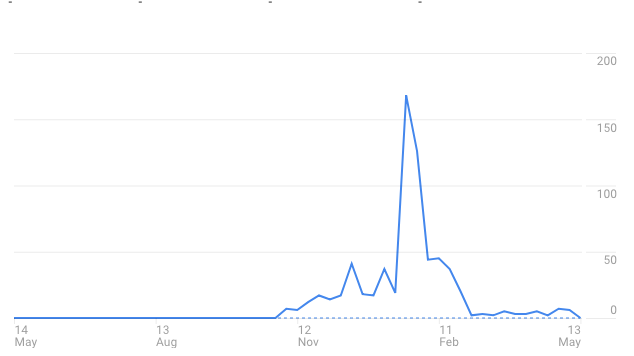

Those following me on Twitter/Medium/this blog may remember the job board I launched back in December last year: [JobsOk.io](https://maxrozen.com/2017/12/20/my-side-project-jobsok-io). Essentially it's a purely serverless job board - A React frontend with an Apollo GraphQL client fetching data, and a NodeJS backend running GraphQL resolvers to pull the data out of DynamoDB. I also pay $9/mo to Pre-render my pages, so that Google can index my site properly.

In case you're wondering, here's how it went:

## Essentially, no where.

But that's okay! Because it costs me 50 cents per month to run (Pesky Route53 domain costs!). That major spike in the middle there was when I "launched" by spending $20 on AdWords to see whether there was any need for yet another Job Board. Turns out there is, in Ukraine and Romania.

# Stage 2 - Static/Server-side Rendering for SEO

So in case you haven't noticed - I don't run the site for profit, it's primarily motivated by learning. So paying $9/mo to pre-render my pages was fine initially, but I want to learn how to build my projects with Server-side rendering.

So I've decided to learn in public, and here we are.

First thing I'm doing is going through this guide:

* https://medium.freecodecamp.org/demystifying-reacts-server-side-render-de335d408fe4

And its accompanying Github Repository:

* https://github.com/alexnm/react-ssr

This helped get me most of the way to refactoring the JobsOk frontend for server-side rendering, but the one thing I'm still missing is the Apollo GraphQL for SSR.

I plan on going through this documentation:

* https://www.apollographql.com/docs/react/features/server-side-rendering.html#server-rendering

and posting the results here.
