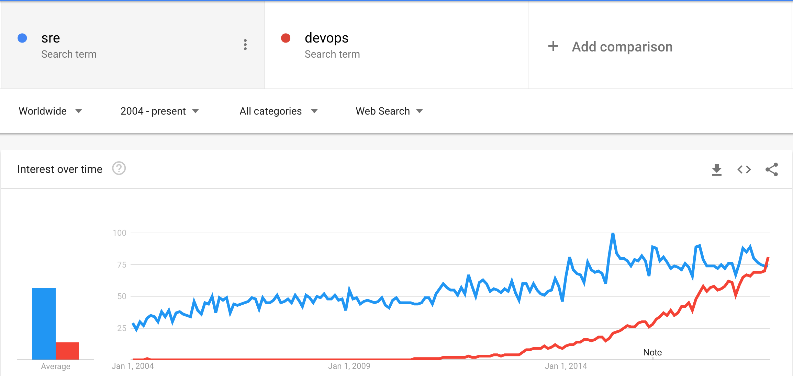

_Originally published at <a href="https://onlineornot.com/blog/server-web-app-reliability-rise-of-site-reliability-engineer-sre">OnlineOrNot</a> on October 3, 2018 by Me (Max Rozen)_

If you've ever heard a new term, and then suddenly saw it everywhere, you know how I felt in 2015, finishing off my Honours thesis on Web Application Performance Testing and seeing Site Reliability Engineering (SRE) suddenly becoming a thing (Google seems to have come up with the position way back in 2003, funnily enough).

So there I was essentially creating and measuring my own Denial of Service attacks against my own WordPress server to figure out how resilient it was, and how many concurrent users it could support (10, in case you were wondering - it ran on a used laptop) while industry had come across this issue about 12 years earlier.

It seems however that DevOps (which I consider similar in function to SRE) as a search term only took off at the start of 2011, which sort of coincides with the sort of simultaneous realisation everyone from Google to Atlassian had, that you could just host your own software and let users access it via a web application and you wouldn't have to support users installing Java applications on Windows 95 era machines.

### Enough rambling, WTF is SRE?

Google defines SRE as what would happen if you tasked software engineers with the day-to-day running of a web application (operations). As Andrew Widdowson, a veteran Site Reliability Engineer at Google notes, it's all about keeping your services super fast, and super reliable, all the time - "We change the tires of a race car as it’s going 100mph".

If you're reading this, chances are, you're not operating at Google's planet-wide scale, nor do you intend to. So what do you stand to gain from reading this article? With [OnlineOrNot](https://onlineornot.com), I intend to solve Site Reliability Engineering (that is, availability, latency, performance, and capacity) monitoring for the micropreneurs, indiehackers, and general small internet business owners that just want an alert when things go wrong.

While I can't handle the emergency response of getting your web application back up and running, I can damn well alert you at any time via Email, Text Message or Slack simultaneously (assuming you haven't set Do Not Disturb hours).
