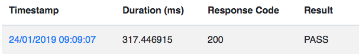

We can all agree testing is quite important if you want to maintain developer happiness. It makes refactoring code a joy, and it generally helps build confidence in your codebase.

In general, unit tests are possible in GraphQL by testing your resolvers, and ensuring the logic is sound. But what if we want to test a whole query, and detect when fields are deleted, renamed, added or fields return different data?

I'll show you a quick code example of how you can do this locally.

## Using Jest for GraphQL Snapshot Testing

You can clone a demo repo for this blog post here: https://github.com/rozenmd/graphql-snapshot-testing

```js
import graphqlHTTP from 'express-graphql'
import { getCountries } from './resolvers'
import schema from './schema'

test('the snapshot matches', async () => {
  // create a graphlhttp middleware
  const middleware = graphqlHTTP({
    //some schema containing the fields we're about to query
    schema,
    rootValue: {
      id: 'viewer',
      loaders: {
        //mock the data somehow
        countries: getCountries,
      },
    },
  })

  // create a mocked request
  const request = {
    method: 'POST',
    headers: {},
    //replace with your query
    body: { query: '{ viewer { countries { name } } }' },
  }

  // create a mock response, graphql middleware calls json() to set response data, so we need to mock it.
  const response = {
    setHeader: jest.fn(),
    end: jest.fn(),
    json: jest.fn(),
  }

  // call middleware function with mocked response and request
  await middleware(request, response)

  // get json's stub function arguments, this is actually a data returned by graphql middleware
  const responseData = response.json.mock.calls[0][0]
  // use jest.snapshot to snapshot test
  expect(responseData).toMatchSnapshot()
})
```

If you ran the test at this point, it would pass (since it's taking the initial value as the Expected Result).

In our repo, the getCountries function returns this array:

```js
return [
  { id: 1, name: 'United States of America', population: 325700000 },
  { id: 61, name: 'Australia', population: 24600000 },
]
```

Let's now change it to:

```js
return [
  { id: 1, notName: 'United States of America', population: 325700000 },
  { id: 61, notName: 'Australia', population: 24600000 },
]
```

Jest will now complain:

```js
FAIL  src/index.test.js
  ✕ the snapshot matches (35ms)

  ● the snapshot matches

    expect(value).toMatchSnapshot()

    Received value does not match stored snapshot "the snapshot matches 1".

    - Snapshot
    + Received

      Object {
    -   "data": Object {
    -     "viewer": Object {
    -       "countries": Array [
    +   "errors": Array [
    +     Object {
    +       "locations": Array [
              Object {
    -           "name": "United States of America",
    +           "column": 24,
    +           "line": 1,
              },
    -         Object {
    -           "name": "Australia",
    -         },
            ],
    +       "message": "Cannot query field "name" on type "Country".",
    +       "path": undefined,
          },
    -   },
    +   ],
      }

      38 |   const responseData = response.json.mock.calls[0][0]
      39 |   // use jest.snapshot to snapshot test
    > 40 |   expect(responseData).toMatchSnapshot()
         |                        ^
      41 | })
      42 |

      at Object.toMatchSnapshot (src/index.test.js:40:24)

 › 1 snapshot failed.
Snapshot Summary
 › 1 snapshot failed from 1 test suite. Inspect your code changes or run `yarn test -u` to update them.

Test Suites: 1 failed, 1 total
Tests:       1 failed, 1 total
Snapshots:   1 failed, 1 total
Time:        2.797s
Ran all test suites.
```

There you have it. Snapshot testing in Jest. To give your GraphQL schema full coverage you would have to repeat this process for every single query you use.

Alternatively, let me introduce you to [OnlineOrNot](https://onlineornot.com) - an automated GraphQL Snapshot Testing service.

## Using OnlineOrNot for GraphQL Snapshot Testing

All we need to do is:

- Define a GraphQL server to test on the "Create Application" page:
  
- Paste a GraphQL query on the "Create Test" page:
  

Once that's setup, when you click on a Test to view, you'll see a Results section:


After a minute, you'll start to have the results of your snapshot tests:


You can then click into the Result to see the data OnlineOrNot observed, and how it compares to the expected result:


<!-- ## Interested?

You can try OnlineOrNot for free for 14 days at [OnlineOrNot.com](https://OnlineOrNot.com), or if you have any questions feel free to email me at <a href="mailto:max@onlineornot.com">max@onlineornot.com</a> -->
