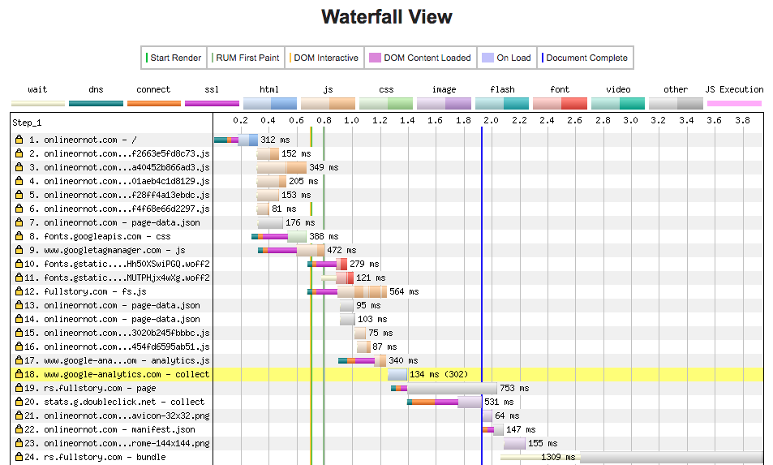
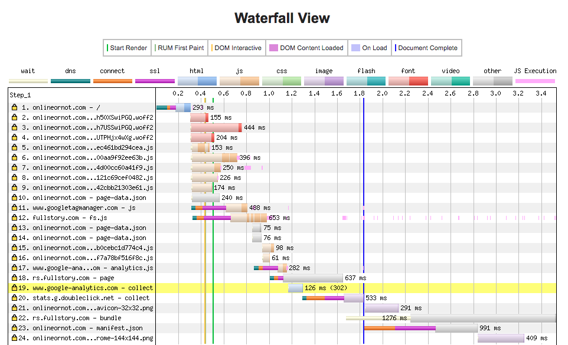

### Why is Google Fonts an issue?

The cost of using a call such as

```css
@import url('https://fonts.googleapis.com/css?family=Lato:300,400,900');
```

is that the browser first has to download the CSS file, and parse it. Afterwards, the browser downloads your fonts. This process is particularly syncronous, so we can't download your fonts until we ask Google for the location of the font files we need.

### How do we speed things up?

We can get a large performance boost by self-hosting our fonts. To do this, you would need to:

1. Use [google-webfonts-helper](https://google-webfonts-helper.herokuapp.com/fonts) to figure out which fonts you needed to download
1. Check them into your repo
1. Reference them in your CSS
1. Ensure that CSS is in-lined in your HTML, and among the first CSS to be read by browsers

This is a bit involved, but totally worth it. At a previous employer I managed to shave 300ms off of page load time by self-hosting fonts.

### Enter gatsby-plugin-prefetch-google-fonts

Now with [gatsby-plugin-prefetch-google-fonts](https://www.gatsbyjs.org/packages/gatsby-plugin-prefetch-google-fonts/), you can save 3-400ms with a little bit of configuration.

1. Install:
   `yarn add gatsby-plugin-prefetch-google-fonts`
1. Configure `gatsby-config.js`:

```js
  {
      resolve: `gatsby-plugin-prefetch-google-fonts`,
      options: {
        fonts: [
          {
            family: `Lato`,
            variants: [`300`, `400`, `900`],
          },
        ],
      },
    },
```

### Results

#### Before:


[WebPageTest result](https://webpagetest.org/result/191009_JR_9137ae367dcfa3e9ada6ac38bb7be68e/)

If you look at the time spent by Resource 8, 10, and 11, you can see we're waiting quite a bit just to get the page's fonts loaded.

It's also not the first thing the browser does, so we're likely going to see a flash of missing font. This also depends on what your `font-display` setting is in CSS.

#### After:


[WebPageTest result](https://webpagetest.org/result/191009_2F_fc704f0002d28867cc09b7c43bdc3831/)

After adding the prefetch plugin, we can see Resource 2, 3, and 4 being immediately loaded once we fetch the page.

I was so impressed with these results that I wrote this blog post!
