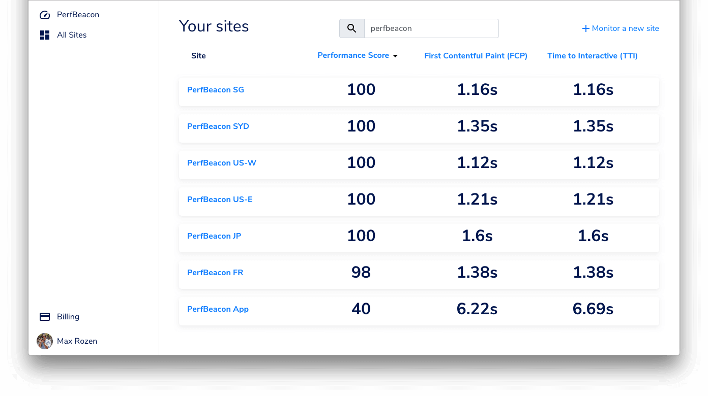

So, at the end of 2018 I wrote this article: [2018: Reflections on trying to start an internet business](https://maxrozen.com/2018/12/31/2018-review-starting-an-internet-business), at the end of which I promised I would:

- Launch OnlineOrNot, the GraphQL monitoring solution
- Go camping more

How did I do? Well:

## Real-life

We travelled and camped quite a bit!

We went camping with friends from work in Mudgee, NSW in the middle of the year, where it was as low as 0 celsius overnight. The upside of the cold being a lack of insects. Mudgee's great if you like wine and fresh air.

Later in the year we camped in the Myall Lakes National Park, south of Forster. Much warmer this time, and many, many more insects. Also it's next to a ridiculously long beach, great for chilling out.

Over Christmas, we hiked Mount Kosciuszko (highest mountain in Australia) - a 13 kilometer walk from the Thredbo chairlift. It was a really nice break from sitting in front of a laptop all day long.

## Work

I worked at Expert360 as a full-time employee, working on the React frontend. After speeding up their frontend's performance (Time to Document Complete) by 75% and scrapping the microfrontend architecture in favour of a monolithic React app to save 4 seconds on each page load, I decided to go off in search of bigger and better challenges. In doing so, I also noticed I really enjoyed the challenges of tracking down performance issues on the web.

I ended up working for a large Australian marketing/advertising business, and yet again found myself working at a company that advertised a job description that didn't meet the reality of what the business needed. I lasted about two months before realising they wouldn't be needing my skills for months, and I didn't want to sit around building features for their WordPress site.

So I became a contractor! I'm currently building [SiteHive's](http://sitehive.co/) entire React frontend, data pipelines, and Node/GraphQL backend, while also building the foundation for a design system in the future.

SiteHive is an extremely early stage startup, having just made it out of an accelerator program. It's been incredibly eye-opening to witness first-hand how to find customers (mainly through personal networks), and how we use customer conversations to feed the product roadmap.

## After Work

### OnlineOrNot

OnlineOrNot was a GraphQL monitoring service that took snapshots of your queries, and checked them at intervals to ensure your resolvers would return what you expected them to.

My main means of acquiring users was content marketing, targeting two main keywords: 'graphql testing' and 'graphql monitoring'. Neither was particularly successful.

'graphql testing' received 929 impressions, and 3 clicks.

'graphql monitoring' received 83 impressions, and 1 click.

So if directly targeting keywords didn't work, what did?

Complaining! I wrote an article [comparing two GraphQL clients: Apollo and Relay](https://medium.com/@RozenMD/apollo-vs-relay-modern-an-unbiased-look-at-which-graphql-client-to-use-b0143663e0ec), in which I mainly complained about their shortcomings, and in total received 20.2k impressions, and 2.28k clicks for "Relay", and 21.1k impressions, 2.41k clicks for "Apollo".

In the past 12 months OnlineOrNot received 65k total impressions, leading to 4.82k clicks, leading to 54 real signups, which lead to 1 paid user (who I sold to personally, rather than relying on content marketing).

Lesson learnt: recruit your first customers.

In short, OnlineOrNot launched on HackerNews, ProductHunt, and IndieHackers. It received very little attention, I gave it a few months to see how well content marketing would go, and I sort of gave up.

Kind of.

In September I started rewriting OnlineOrNot to be a simple uptime monitoring solution (a space with many, many competitors), with the aim of answering a single question: is my site still online, if not, what's happening?

I have no plans on a public launch, and I'm happy with just using it while contracting as a web developer.

### Using a template: revisited

Though that's not the end of my indie-hacker story. Last year I [built a template to make launching SaaS ideas faster](https://maxrozen.com/2018/12/31/2018-review-starting-an-internet-business#using-a-template-to-build-side-projects). This year I spent some time developing the overall "framework" a SaaS idea needs, adding:

- Auth0 integration
- More robust authentication code (seriously, check this out)
  
- Rewrote most of the frontend to use React Hooks (for readability, mostly)
- Stripe integration
- Mailchimp integration
- Subscription handling (particularly feature availability in trials, but also pricing/subscription pages within the apps)

While building these features I noticed the AWS Lambda architecture I used in OnlineOrNot made swapping out the "core" of the business extremely simple, and launching another business in parallel wouldn't take much effort.

### Introducing PerfBeacon

At Expert360, I found the manual work involved in optimising a web application's performance frustrating, and went searching for better tooling. [PerfBeacon](https://perfbeacon.com) was started out of a desire to help improve performance across the web, and the realisation that one cannot improve without first measuring.

PerfBeacon is a synthetic frontend performance monitor, similar to how OnlineOrNot worked when it tested GraphQL queries. It runs Google Lighthouse from anywhere in the world you'd like (assuming there's an AWS datacentre there...) against a webpage, extracts key metrics you'd like to visualise, and graphs them for you.

The coolest thing I've found about it so far is that it lets you find where in the world your CDN isn't performing as well as it could be:

In terms of idea validation, I mainly just put up a landing page, and started a [Twitter account](https://twitter.com/PerfBeacon) to follow interesting people in web performance. Since starting in mid October, I've had 307 visitors on the website, resulting in 19 subscriptions to the mailing list (I still have no idea what I'm doing with mailing lists, I'll probably send a "We've launched!" email, and that's about it).

While this is roughly half the attention OnlineOrNot received, people are actually signing up to the mailing list, and I'm thinking this idea might have legs after all. If not, I'll still use it daily to monitor frontend performance every time I deploy, so not all will be lost.

## Main things I learned this year

### Recruit your first customers

This year I read [The Mom Test](http://momtestbook.com/), and [Your first ten customers](https://stripe.com/atlas/guides/starting-sales), and I think I finally _get_ the whole customer acquisition/sales thing.

Getting your first 10 customers from content marketing alone is:

1. Extremely difficult to get right
1. Kind of a waste of time (unless you've got thousands of people in your mailing list)

Talking to customers is the fastest way to figure out if the problem you're solving is even a problem at all.

### Your MVP can really be extremely minimal

As part of our accelerator program, SiteHive had to demonstrate its solution to potential investors and customers by a certain date. I shipped a demo with barely functioning login (hardcoded values in the backend), no database, and just a bunch of charts stuck together in React.

While the solution was quite sparse, it was already solving the problem at this point.

We were able to have highly valuable conversations with potential customers and investors with only the core features they cared about (the data visualisation). It made me realise that I really over-engineer my side-projects, thinking that everything had to be _done_ to be able to launch.

### Your tech stack does not matter

This year I worked for a company that pulls in millions in revenue per month from an insanely beefy WordPress installation. The engineering team's velocity of being able to ship features was probably the lowest I've ever seen, and yet the business was still making bank.

The takeaway here is to just use whatever technology you're comfortable with.

There is no shame in using Ruby on Rails, Django, or even a code-free solution like Airtable/Zapier in 2020.

Shipping something that people find useful/valuable beats using Svelte/Vue/Angular/React or whatever people are arguing about in JavaScript frameworks.

## 2020 Plans

### Finish up PerfBeacon, and launch!

I originally was going to wait until PerfBeacon was "feature-complete" before launching, but after working for SiteHive for a few months, I've realised getting _anything_ to market, and being able to talk to people about it is much more valuable.

After launching, I'll be making it possible to test on-demand (like during a CI process), and also show screenshots of different points in the tested page's load process.

Writing this section feels like déjà vu - I essentially had an identical goal for OnlineOrNot at the end of 2018.

This time it'll be different though. I won't be relying on/praying for content marketing to do the job for me, and instead will be reaching out to companies in real life to discuss how they track their web performance.

### Screencasts

Around October this year I bought a microphone with the intention of making screencasts explaining things in JavaScript and React that took me ages to understand. I didn't get around to actually doing it in between hunting for jobs and building PerfBeacon and OnlineOrNot, so hoping to get some out there next year. I intend to follow these [awesome guides](https://howtoegghead.com/instructor/screencasting/) from egghead.io.

## Ciao!

Anyway, here’s me signing off for 2019, Happy New Year folks!
