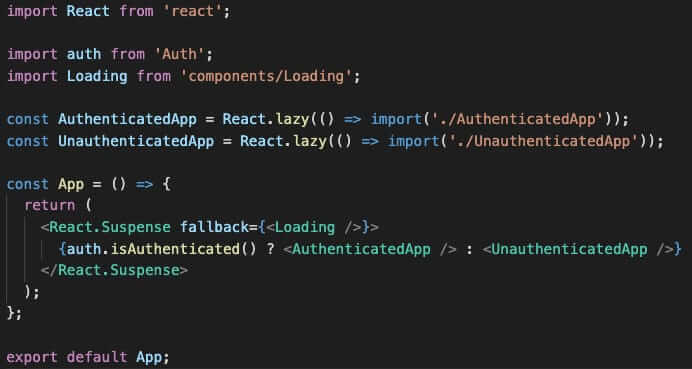

So, at the end of 2018 I wrote this article: [2018: Reflections on trying to start an internet business](https://maxrozen.com/2018/12/31/2018-review-starting-an-internet-business), at the end of which I promised I would:

- Launch OnlineOrNot, the GraphQL monitoring solution
- Go camping more
- Sell some camera gear

How did I do? Well:

### Real-life

We travelled and camped quite a bit!

We went camping with friends from work in Mudgee, NSW in the middle of the year, where it was as low as 0 celsius overnight. The upside of the cold being a lack of insects. Mudgee's great if you like wine and fresh air.

Later in the year we camped in the Myall Lakes National Park, south of Forster. Much warmer this time, and many, many more insects. Also it's next to a ridiculously long beach, great for chilling out.

### Work

I worked at Expert360 as a full-time employee, working on the React frontend. After speeding up their frontend's performance (Time to Document Complete) by 75% and scrapping the microfrontend architecture in favour of a monolithic React app to save 4 seconds on each page load, I decided to go off in search of bigger and better challenges. In doing so, I also noticed I really enjoyed the challenges of tracking down performance issues on the web.

I ended up working for a large Australian marketing/advertising business, and yet again found myself working at a company that advertised a job description that didn't meet the reality of what the business needed. I lasted about two months before realising they wouldn't be needing my skills for months, and I didn't want to sit around building features for WordPress.

So I became a contractor! I'm currently building [SiteHive's](http://sitehive.co/) entire frontend, data pipelines, and GraphQL backend, while also building the foundation for a design system in the future.

### After Work

#### OnlineOrNot

OnlineOrNot was a GraphQL monitoring service that took snapshots of your queries, and checked them at intervals to ensure your resolvers would return what you expected them to.

My main means of acquiring users was content marketing, targeting two main keywords: 'graphql testing' and 'graphql monitoring'. Neither was particularly successful.

'graphql testing' received 929 impressions, and 3 clicks.

'graphql monitoring' received 83 impressions, and 1 click.

So if directly targeting keywords didn't work, what did?

Complaining! I wrote an article [comparing two GraphQL clients: Apollo and Relay](https://medium.com/@RozenMD/apollo-vs-relay-modern-an-unbiased-look-at-which-graphql-client-to-use-b0143663e0ec), in which I mainly complained about their shortcomings, and in total received 20.2k impressions, and 2.28k clicks for "Relay", and 21.1k impressions, 2.41k clicks for "Apollo".

In the past 12 months OnlineOrNot received 65k total impressions, leading to 4.82k clicks, leading to 54 real signups, which lead to 1 paid user (who I sold to personally, rather than relying on content marketing).

Lesson learnt: recruit your first customers.

In short, OnlineOrNot launched on HackerNews, ProductHunt, and IndieHackers. It received very little attention, I gave it a few months to see how well content marketing would go, and I sort of gave up.

Kind of.

In September I started rewriting OnlineOrNot to be a simple uptime monitoring solution (a space with many, many competitors), with the aim of answering a single question: is my site still online, if not, what's happening?

I have no plans on a public launch, and I'm happy with just using it while contracting as a web developer.

#### Using a template: revisited

Though that's not the end of my indie-hacker story. Last year I [built a template to make launching SaaS ideas faster](https://maxrozen.com/2018/12/31/2018-review-starting-an-internet-business#using-a-template-to-build-side-projects). This year I spent some time developing the overall "framework" a SaaS idea needs, adding:

- Auth0 integration
- More robust authentication code (seriously, check this out)
  
- Stripe integration
- Mailchimp integration
- Subscription handling (particularly feature availability in trials, but also pricing/subscription pages within the apps)

While building these features I noticed the AWS Lambda architecture I used in OnlineOrNot made swapping out the "core" of the business extremely simple, and launching another business in parallel wouldn't take much effort.

#### Introducing PerfBeacon

At Expert360, I found the manual work involved in optimising a web application's performance frustrating, and went searching for better tooling. [PerfBeacon](https://perfbeacon.com) was started out of a desire to help improve performance across the web, and the realisation that one cannot improve without first measuring.

In terms of idea validation, I mainly just put up a landing page, and started a [Twitter account](https://twitter.com/PerfBeacon) to follow interesting people in web performance. Since starting in mid October, I've had 276 visitors on the website, resulting in 17 subscriptions to the mailing list.

So I'm thinking this idea might have legs after all.
